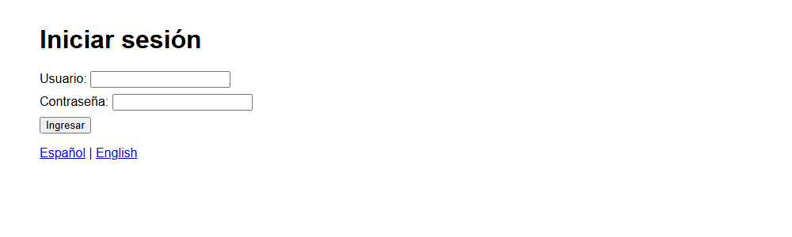
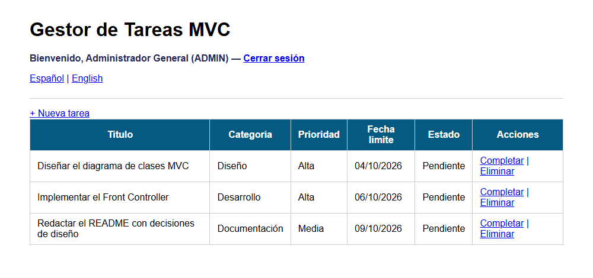
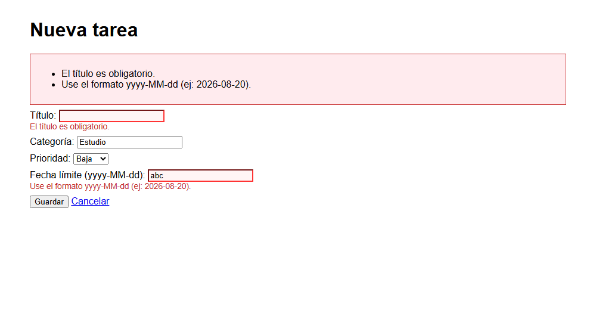
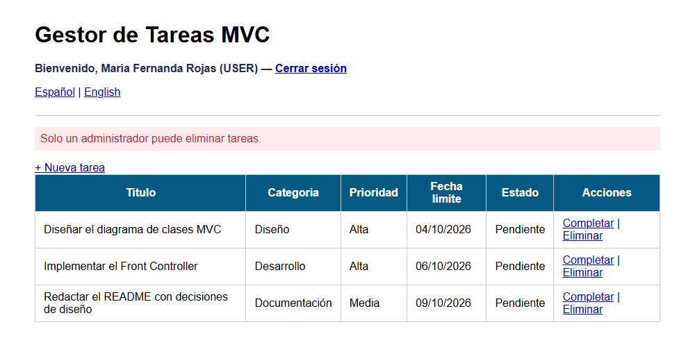
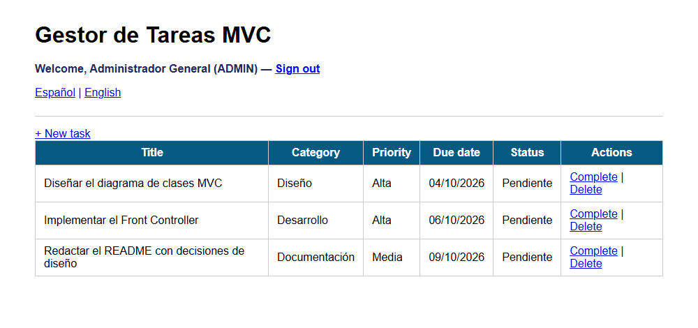

# Post-contenido Unidad 6: MVC con Front Controller, sesión e i18n

## Descripción
Repositorio del laboratorio de la Unidad 6 de Programación Web (séptimo semestre). Contiene un único proyecto Maven Web, `gestor-tareas-mvc`, que formaliza el patrón MVC con un Front Controller y el patrón Comando sobre un gestor de tareas. La Parte 1 construye el Front Controller y el CRUD de tareas. La Parte 2 extiende el mismo proyecto con autenticación por sesión con roles, validación por campo e internacionalización.

## Parte 1: Front Controller y patrón Comando
`FrontControllerServlet` es el único punto de entrada (`/app`) y delega en objetos Comando (`ListarComando`, `FormularioComando`, `GuardarComando`, `EliminarComando` y `CompletarComando`). `TareaService` y `TareaDAO` separan la lógica de negocio y el acceso a datos del controlador. Las vistas usan JSTL y Expression Language, sin scriptlets, y cada operación que modifica datos termina en un redirect (Post/Redirect/Get).

## Parte 2: sesión con roles, validación por campo e i18n
`FrontControllerServlet` verifica la sesión una sola vez, antes de resolver cualquier comando protegido. `LoginComando` y `LogoutComando` gestionan `HttpSession` con los roles ADMIN y USER, y `EliminarComando` solo deja eliminar al rol ADMIN. `GuardarComando` valida cada campo por separado y usa el límite de longitud del título que se lee del contexto de aplicación (`web.xml`). `IdiomaComando` guarda la preferencia de idioma en una cookie, que las vistas leen con el objeto EL `cookie` junto con `ResourceBundle` (`messages.properties` y `messages_es.properties`).

## Funcionalidades implementadas
- Listar, crear, completar y eliminar tareas, con Post/Redirect/Get en cada operación.
- Inicio y cierre de sesión con `HttpSession` y roles ADMIN y USER.
- Verificación de sesión en un único punto, que protege todos los comandos salvo `login` e `idioma`.
- Eliminación de tareas restringida al rol ADMIN.
- Validación por campo con mensaje junto a cada campo y repoblado del formulario.
- Selector de idioma español e inglés, guardado en una cookie que sobrevive al cierre de sesión.
- Nombre de la aplicación y longitud máxima del título configurados en `web.xml`.

Usuarios de prueba: `admin` con clave `Admin123!` (rol ADMIN) y `maria` con clave `Maria2026!` (rol USER).

## Decisiones de diseño
- El Comando devuelve la ruta de la vista, o `null` si ya resolvió la respuesta con un redirect, y no hace el forward por su cuenta. Así `FrontControllerServlet.procesar()` concentra esa llamada en un solo lugar y puede aplicar lógica común después de ejecutar cualquier comando.
- Se usó un Front Controller en lugar de un Servlet por acción. Toda petición pasa por `procesar()`, de modo que la verificación de sesión de la Parte 2 se escribió una vez y cubre cualquier comando nuevo sin cambios de seguridad adicionales.
- El nombre del usuario y su rol viven en `HttpSession` porque deben desaparecer cuando la sesión expira o se cierra. El idioma vive en una cookie porque debe sobrevivir al cierre de sesión, y hasta la pantalla de login tiene que verse en el idioma elegido.
- La longitud máxima del título se lee del contexto de aplicación (un `context-param` de `web.xml`) en vez de escribirla como literal en `GuardarComando`. La regla se puede cambiar sin recompilar y cualquier otro comando puede leer el mismo valor.

## Cómo compilar y desplegar
Requisitos: JDK 17, Maven 3.8 o superior, Apache Tomcat 10.x (puerto 8080 libre) y Git.

1. Clonar el repositorio: `git clone https://github.com/julianejurado-rgb/jurado-post1-u6.git`
2. Abrir la carpeta como proyecto Maven en el IDE.
3. Ejecutar `mvn clean package`. Genera `target/gestor-tareas-mvc-1.0-SNAPSHOT.war`.
4. Desplegar en Tomcat: configurar un servidor Tomcat local en el IDE con el artefacto war exploded, o copiar el WAR a la carpeta `webapps` de Tomcat con el nombre `gestor-tareas-mvc.war`.
5. Abrir `http://localhost:8080/gestor-tareas-mvc/app`. Sin sesión, la aplicación redirige al login.

## Capturas de pantalla
Pantalla de login:

Listado de tareas con un administrador:

Formulario con validaciones por campo (título vacío y fecha en formato inválido):

Restricción de rol al intentar eliminar con un usuario USER:

Selector de idioma con la interfaz en inglés:

